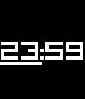
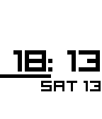
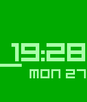

# beam-up

Minimal sharp-edged animated watchface for [Pebble](https://getpebble.com) smartwatch.

## Features

* Every changed digit is 'beamed up'.

* 15-second interval animated indicator.

## Customisations

Using the 'Settings' button in the Pebble app after install, choose from the following variants:

* Pick a theme (Basalt only)

* Inverted colours (through 'Inverted Classic' theme on Basalt)

* Show short date

* Animations

* Show disconnected indicator

* Shake to show battery level

* Vibrate on the hour

* Vibration types
